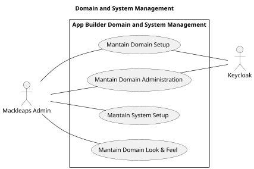
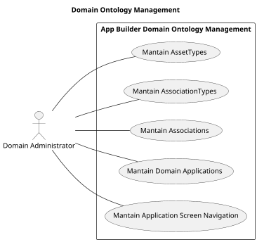
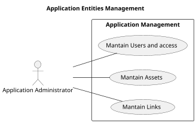

# APP BUILDER USE CASES

## Domain and System Management

```plantuml
@startuml

left to right direction
scale 0.7

title "Domain and System Management"

actor "Mackleaps Admin" as MA
actor "Keycloak" as K

rectangle "App Builder Domain and System Management" {
    usecase "Mantain Domain Setup" as ABDSM_001
    usecase "Mantain Domain Administration" as ABDSM_002
    usecase "Mantain System Setup" as ABDSM_003
    usecase "Mantain Domain Look & Feel" as ABDSM_004
}

MA -- ABDSM_001
ABDSM_001 -- K
MA -- ABDSM_002
ABDSM_002 -- K
MA -- ABDSM_003
MA -- ABDSM_004

@enduml
```

## Domain Ontology Management

```plantuml
@startuml

left to right direction
scale 0.7

title "Domain Ontology Management"

actor "Domain Administrator" as DA

rectangle "App Builder Domain Ontology Management" {
    usecase "Mantain AssetTypes" as ABDOM_001
    usecase "Mantain AssociationTypes" as ABDOM_002
    usecase "Mantain Associations" as ABDOM_003
    usecase "Mantain Domain Applications" as ABDOM_004
    usecase "Mantain Application Screen Navigation" as ABDOM_005
}

DA -- ABDOM_001
DA -- ABDOM_002
DA -- ABDOM_003
DA -- ABDOM_004
DA -- ABDOM_005

@enduml
```

## Application Management

```plantuml
@startuml

left to right direction
scale 0.7

title "Application Entities Management"

actor "Application Administrator" as AA

rectangle "Application Management" {
    usecase "Mantain Users and access" as AM_001
    usecase "Mantain Assets" as AM_002
    usecase "Mantain Links" as AM_003
}

AA -- AM_001
AA -- AM_002
AA -- AM_003


@enduml
```