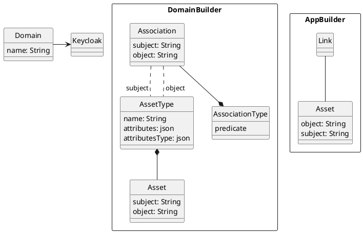

# Asset-API

This api should be used to store assets and their associations in a RDF (Resource Description Framework) oriented form.

##  Requirements

- Docker installed  
- Docker Compose installed

##  Step-by-step to run the project

#### 1. Create the .env file in the root of the this subpart

In the root directory of this subproject, create a file named `.env` with the following content:
```bash
MYSQL_ROOT_PASSWORD=<YOUR_PASSWORD>
MYSQL_PASSWORD=<YOUR_PASSWORD>
MYSQL_DATABASE=asset_api
MYSQL_USER=asset_api
```
Do not share this file. It contains sensitive information.


### 2. Update application.properties configuration

Navigate to the src/main/resources directory and locate the file named application.properties.

Edit the following properties to match your environment:
```java
spring.application.name=AssetAPI
db.url=http://<YOUR_DB_HOST>:<YOUR_DB_PORT>
db.token=mytoken
db.user=<YOUR_DB_USER>
server.port=8090
```

### 3. Configuring Database Connection in Code

Navigate to the following directory:
- src/main/java/br/mackenzie/mackleaps/asset/persistence/db

Inside this folder, locate the file named `ClientConnection.java`.

You must update the database connection parameters in this file to match your environment.

```java
config.setJdbcUrl("jdbc:mariadb://<DB_HOST>:<DB_PORT>/<DB_NAME>");
config.setUsername("<DB_USERNAME>");
config.setPassword("<DB_PASSWORD>");
```
they are the same values as in .env file

### 4. Start the containers with Docker Compose

```bash
docker compose up -d
```

This command will:

- Start the MariaDB database with initial data from asset.sql

- Build the asset-api Java image using the Dockerfile

- Start all services connected to the shared-network

### 5. Restore the backup data

If you have a backup.sql file and want to load its data into the running database:

1. Copy the dump file to the MariaDB container:
```bash
docker cp backup.sql assetApi-db:/tmp/backup.sql
```
2. Access the MariaDB container:
```bash
docker exec -it assetApi-db /bin/bash
```
3. Inside the container, restore the dump into the asset_api database:
```bash
mysql -u root -p asset_api < /tmp/backup.sql
```
Enter the password when prompted (use the one from .env as MYSQL_ROOT_PASSWORD).

## Documentation
Class Diagram



# Entidade relacionamento

```plantuml
hide circle

!define TABLE

'entity "DOMAIN" AS DOMAIN {
'    + NAME : VARCHAR (255)
'    DESCRIPTION : VARCHAR (255)
'    LOOK_AND_FEEL : VARCHAR (4096)
'    I18N_NAME_LABEL: VARCHAR (255)
'    I18N_CREATEUSER_LABEL: VARCHAR (255)
'    I18N_DATECREATED_LABEL: VARCHAR (255)
'    I18N_DESCRIPTION_LABEL: VARCHAR (255)
'    I18N_LASTUPDATED_LABEL: VARCHAR (255)
'    I18N_UPDATEUSER_LABEL: VARCHAR (255)
'    ICON : VARCHAR (255)
'    ICON64 : VARCHAR(4096)
'}

entity "ASSET_TYPE" AS ASSET_TYPE {
    + NAME : VARCHAR (255)
    DOMAIN_NAME: VARCHAR (255)
    I18N_NAME_LABEL: VARCHAR (255)
    I18N_CREATEUSER_LABEL: VARCHAR (255)
    I18N_DATECREATED_LABEL: VARCHAR (255)
    I18N_DESCRIPTION_LABEL: VARCHAR (255)
    I18N_LASTUPDATED_LABEL: VARCHAR (255)
    I18N_UPDATEUSER_LABEL: VARCHAR (255)
    ICON : VARCHAR (255)
    ICON64 : VARCHAR(4096)
    ATTRIBUTES_LABEL : VARCHAR (2048)
    ATTRIBUTES_TYPE : VARCHAR(2048)
}

entity "ASSET" AS ASSET {
    + ID : SERIAL
    ASSET_TYPE_NAME : VARCHAR (255) NOT NULL
    DOMAIN_NAME : VARCHAR(255) NOT NULL
    ATTRIBUTES : VARCHAR (2048)
    NAME : VARCHAR (255)
    DESCRIPTION: VARCHAR (255)
    STATUS : VARCHAR (255)
    URL : VARCHAR (255)
    ICON : VARCHAR (255)
    ICON64 : VARCHAR (4096)
    VERSION : INT
    CREATE_USER: VARCHAR (255)
    DATECREATED: TIMESTAMP
    UPDATEUSER: VARCHAR (255)
    LAST_UPDATED: TIMESTAMP
}

ENTITY "ASSOCIATION_TYPE" AS ASSOCIATION_TYPE {
    + NAME : VARCHAR (255) NOT NULL
    DESCRIPTION : VARCHAR (255)
}

ENTITY "ASSOCIATION" AS ASSOCIATION {
    SUBJECT_TYPE_NAME : VARCHAR (255) NOT NULL
    ASSOCIATION_TYPE_NAME : VARCHAR (255) NOT NULL
    OBJECT_TYPE_NAME : VARCHAR (255) NOT NULL
}

ENTITY "LINK" AS LINK {
    SUBJECT_ID : BIGINT NOT NULL
    ASSOCIATION_TYPE_NAME :VARCHAR (255) NOT NULL
    OBJECT_ID : BIGINT NOT NULL
}

DOMAIN -R-o{ ASSET_TYPE : defines
DOMAIN --o{ ASSET : defines
ASSET_TYPE --o{ ASSET : defines
```

# OpenAPI (Swagger) Documentation

After deploying the application, the OpenAPI definition will be available at `http://ip:port/swagger-ui/index.html` and its JSON/YAML specification in `http://ip:port/v3/api-docs`.
