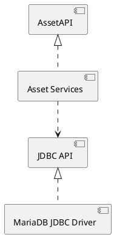
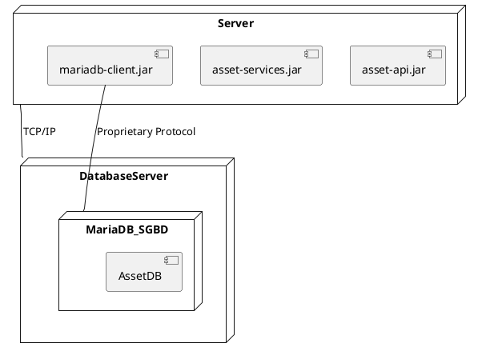
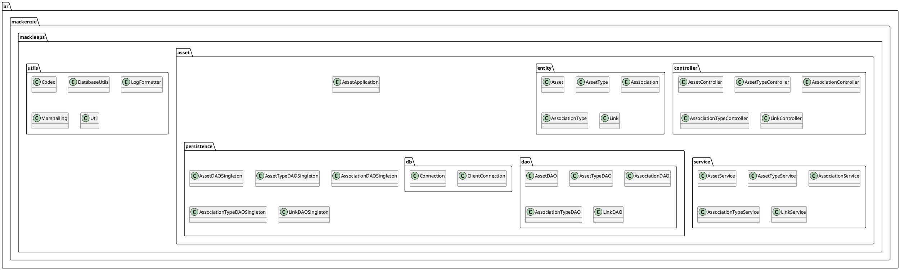

# Asset API 

## Components

```plantuml
@startuml

component "AssetAPI" as API
component "MariaDB JDBC Driver" as JdbcDriver
component "Asset Services" as AssetServices
component "JDBC API" as JdbcAPI

AssetServices .u.|> API
AssetServices ..> JdbcAPI
JdbcDriver .u.|> JdbcAPI


@enduml
```

# Deployment (artifacts)

```plantuml
@startuml

node Server {
    [asset-api.jar]
    [asset-services.jar]
    [mariadb-client.jar]
}

node DatabaseServer {
    node MariaDB_SGBD{
        [AssetDB]
    }
}

Server -- DatabaseServer: TCP/IP
[mariadb-client.jar] -- MariaDB_SGBD: Proprietary Protocol

@enduml
```

# Packages

```plantuml
@startuml

package br.mackenzie.mackleaps.asset {
    class AssetApplication
}

package br.mackenzie.mackleaps.asset.controller {
    class AssetController
    class AssetTypeController
    class AssociationController
    class AssociationTypeController
    class LinkController
}

package br.mackenzie.mackleaps.asset.entity {
    class Asset
    class AssetType
    class Asssociation
    class AssociationType
    class Link
}

package br.mackenzie.mackleaps.asset.service {
    class AssetService
    class AssetTypeService
    class AssociationService
    class AssociationTypeService
    class LinkService
}

package br.mackenzie.mackleaps.asset.persistence {
    class AssetDAOSingleton
    class AssetTypeDAOSingleton
    class AssociationDAOSingleton
    class AssociationTypeDAOSingleton
    class LinkDAOSingleton
}

package br.mackenzie.mackleaps.asset.persistence.dao {
    class AssetDAO
    class AssetTypeDAO
    class AssociationDAO
    class AssociationTypeDAO
    class LinkDAO

}

package br.mackenzie.mackleaps.asset.persistence.db {
    class ClientConnection
    class Connection
}

package br.mackenzie.mackleaps.utils {
    class Codec
    class DatabaseUtils
    class LogFormatter
    class Marshalling
    class Util
}


@enduml
```