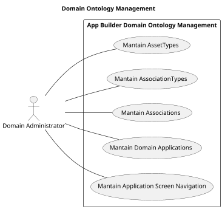

# Domain Builder

SPA used to create ontology structure for the application domain.

```plantuml
@startuml

left to right direction
scale 0.7

title "Domain Ontology Management"

actor "Domain Administrator" as DA

rectangle "App Builder Domain Ontology Management" {
    usecase "Mantain AssetTypes" as ABDOM_001
    usecase "Mantain AssociationTypes" as ABDOM_002
    usecase "Mantain Associations" as ABDOM_003
    usecase "Mantain Domain Applications" as ABDOM_004
    usecase "Mantain Application Screen Navigation" as ABDOM_005
}

DA -- ABDOM_001
DA -- ABDOM_002
DA -- ABDOM_003
DA -- ABDOM_004
DA -- ABDOM_005

@enduml
```
